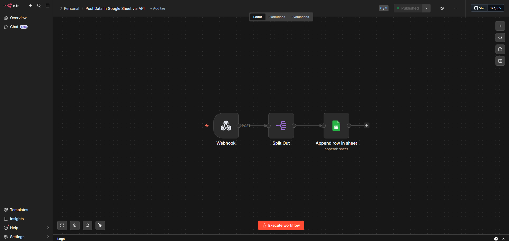

# Google Sheets Automation Workflow with n8n



## Overview
This n8n workflow automates posting data to Google Sheets via API. It is designed to simplify data collection and management without manual effort.

- **Tool Used:** [n8n](https://n8n.io/)
- **Goal:** Automatically send data to Google Sheets for tracking, reporting, or backup.
- **Type:** Portfolio / Automation Example

---

## Workflow Details

### Trigger
- Webhook or scheduled trigger
- Listens for incoming data or runs at a set interval

### Actions
1. **Process Data (Optional)**  
   Format or transform incoming data to match Google Sheets structure.
2. **Google Sheets Node**  
   Appends a new row to the specified sheet with the data.
3. **Optional Actions**  
   Can be extended to push data to GitHub, send emails, or integrate with other tools.

---

## How to Use
1. Clone this repository:
```bash
git clone https://github.com/<your-username>/n8n-google-sheets-workflow.git
